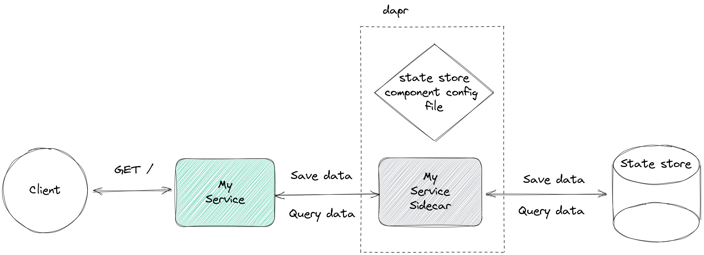

Erkläre components yml


# dapr example - state management

<a href="https://www.dapr.io/"></a>

The following scenario is implemented here.



_My service_ simply stores some data in a data store. But, it does not access the data store
directly. Instead, it passes the data to its dapr sidecar and instructs it to store the data.
Thus, _dapr_ completely abstracts the underlying data store for _My service_.


## Prerequisites

- _dapr_ is [installed](https://docs.dapr.io/getting-started/install-dapr-cli/)


## Get started

### 1. Build the service
```shell
./gradlew buildFatJar
```

### 2. Run the service alongside a dapr sidecar

```shell
dapr run --app-id my-service --app-port 8080 --app-protocol http --dapr-http-port 3500 --components-path components/local/ -- java -cp build/libs/fat.jar com.example.MyServiceKt
```

As you can see, the dapr CLI is used to start up both, the dapr sidecar and the service.


### 3. Be the client - view the dashboard
```shell
curl http://localhost:8080
```


## State store configuration

_dapr_ supports [many](https://docs.dapr.io/reference/components-reference/supported-state-stores/) data stores.
A config file specifies which concrete data store is used for a project.
[From the docs](https://docs.dapr.io/concepts/components-concept/):

_Each component has a specification (or spec) that it conforms to.
Components are configured at design-time with a YAML file which is stored in either:_
- _A `components/local` folder within your solution, or_
- _Globally in the `.dapr` folder created when invoking `dapr init`._

In this project, the configuration file is placed inside the solution.

# References
- [dapr concepts](https://docs.dapr.io/concepts/)
- [dapr state management](https://docs.dapr.io/developing-applications/building-blocks/state-management/)
- [dapr state api](https://docs.dapr.io/reference/api/state_api/)